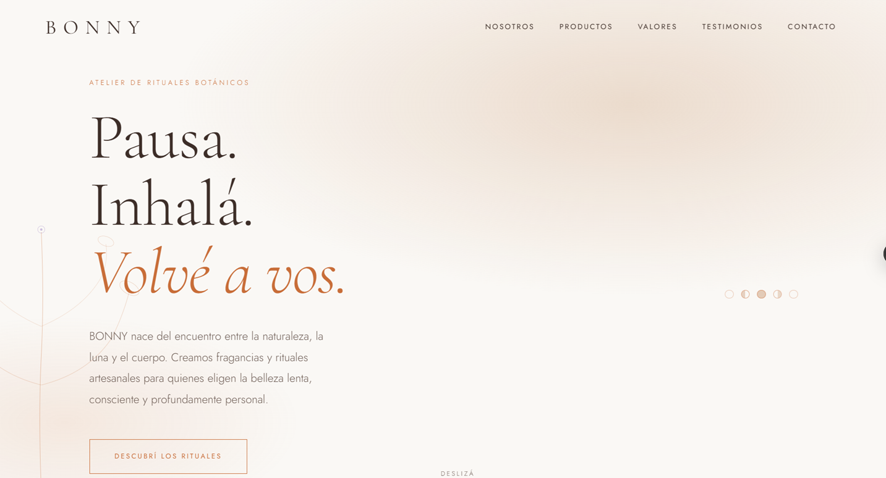
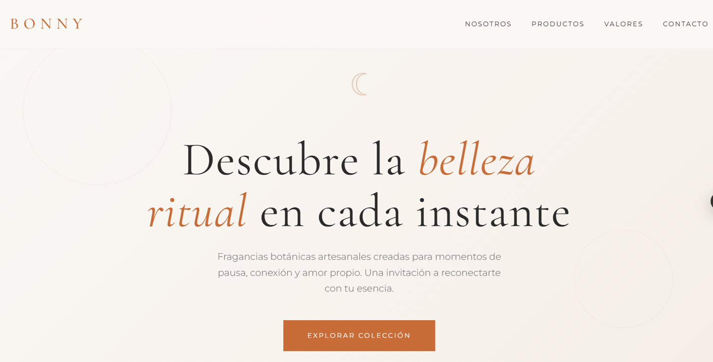

# Prompt Engineering en Agentes de IA

## Datos del estudiante
- Nombre: Vanesa Aracena
- Materia: Frontend / DSW
- Comisión: E
- Institución: IFTS N°29

---

## Deploy del proyecto

Link al sitio publicado en Vercel:

https://landingpagebonny.vercel.app/

Este link dirige a la página principal donde se encuentran las dos landing pages generadas por diferentes agentes de IA.

---

## Prompt utilizado

El siguiente prompt fue utilizado para generar las landing pages:

You are an award-winning Art Director, Luxury Brand Designer, UX/UI Designer, and Senior Front-End Developer.
Create a premium editorial landing page for BONNY, a boutique artisanal self-care brand focused on ritual beauty and botanical fragrances.
Design a website that feels like a luxury fragrance house and ritual beauty atelier rather than a typical e-commerce store.

The experience should evoke:
Calmness
Well-being
Self-care
Botanical rituals
Sensory experiences
Connection with nature
Connection with our body
Slow beauty
Modern mysticism
Lunar inspiration

Visitors should feel invited to pause, breathe, reconnect with themselves, and create intentional fragrance rituals in their daily lives.

Brand
BONNY creates handcrafted products for personal rituals and conscious self-care:
Perfumes
Natural Soaps
Hair Mist
Hair & Body Mist
Body Butter
Natural Deodorant
The brand should feel artisanal, intimate, elegant, warm, and authentic.

Visual Direction
Create a minimalist, editorial, sophisticated, and luxurious design.

Use:
Large elegant serif typography
Editorial magazine-inspired layouts
Generous white space
Asymmetrical compositions
Fine botanical illustrations
Organic line art
Celestial symbols
Moon phases
Subtle animations
Strong visual hierarchy

Avoid:
Corporate layouts
SaaS aesthetics
Generic templates
Bootstrap-like designs
Overcrowded sections
Aggressive marketing visuals

Color Palette

Primary Colors:
Warm Nude #D9B89C
Terracotta #C86D38

Neutrals:
Warm White #FAF8F5

Accent Colors (use sparingly):
Dusty Lavender #8A69B8
Deep Indigo #2F477A

The design should be primarily built around Warm Nude and Terracotta.

Required Sections
Header with logo and navigation menu.

Hero Section with:
Emotional headline
Brand statement
Call-to-action button

About BONNY:
Brand story
Ritual philosophy
Botanical inspiration

Products:
Perfume
Natural Soap
Hair Mist
Hair & Body Mist
Body Butter
Natural Deodorant

Each product should include:
Symbolic illustration
Product title
Short poetic description

Brand Values:
Handmade
Natural ingredients
Small-batch production
Cruelty-free
Conscious self-care

Testimonials:
Include 3 realistic testimonials

Contact Form:
Name
Email
Message
Visual only, no backend required

Footer:
Brand statement
Instagram
Facebook
Pinterest
TikTok

Language
All visible content must be written in fluent Argentine Spanish.
Do not mix English and Spanish.
Use elegant, poetic, warm, sensory, and editorial copywriting.
Avoid generic marketing language.

Technical Requirements
No inline CSS inside HTML
No style tags inside HTML
No embedded scripts unless required
Fully structured as a real production project
All assets referenced via relative paths
No frameworks (no React, no Tailwind, no Bootstrap)
Fully responsive and mobile-first
Semantic HTML5 and accessible structure

Output Format
Provide the project as separate files:
index.html
styles.css
script.js (if needed)

Do not combine them into a single file.

---

## Capturas de pantalla

### Landing Page 1 (Cursor)

### Landing Page 2 (Devin)

---

## Estructura del proyecto

- index.html → selector principal
- landing1 → generada con Cursor
- landing2 → generada con Cascade (Windsurf)
- css/js → recursos compartidos del index

---

## Descripción del proyecto

Este proyecto compara la capacidad de dos agentes de inteligencia artificial en la generación de interfaces web a partir de un mismo prompt de diseño.